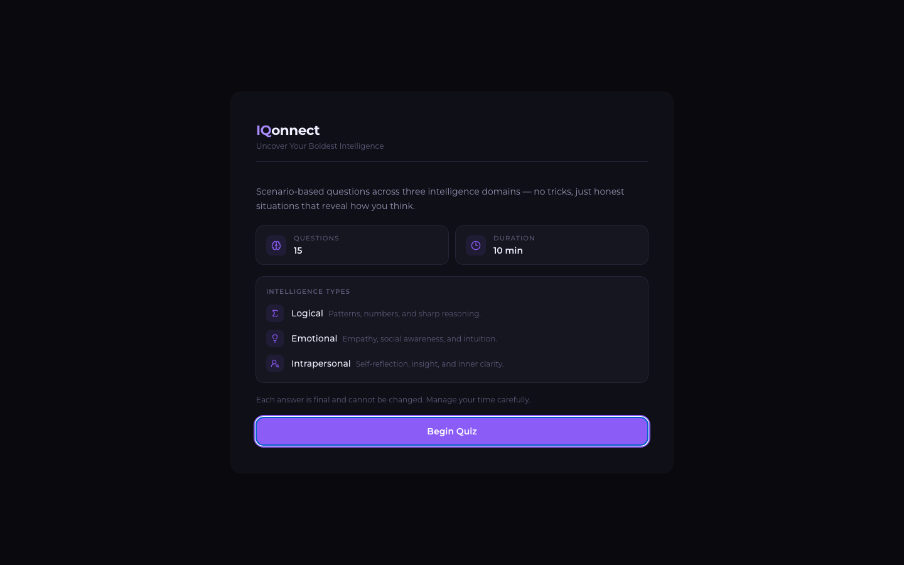

# IQonnect

Answer 15 scenario-based questions and find out whether you lead with Logical, Emotional, or Intrapersonal intelligence.

<p align="center">
  
</p>

## Performance

| Metric | Score |
|---|---|
| Lighthouse Performance | 99 |
| Accessibility | 96 |
| SEO | 100 |

## Features

- 15 scenario-based questions with a countdown timer
- Tracks scores across Logical, Emotional, and Intrapersonal categories
- Reveals your dominant intelligence type at the end
- Keyboard accessible

## Tech Stack

- React 18 + TypeScript
- Vite
- Tailwind CSS

## Getting Started

```sh
git clone https://github.com/your-username/IQonnect.git
cd IQonnect
npm install
npm run dev
```
